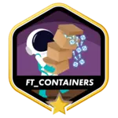

<div align="center">
	
	
	<h1>42 Project Badges</h1>
	
	
	
	
	
	
	
	
	
	
	
	
	
	
	
	
	
	
	
	
	
	
	
	
	
	
	
	
	
	
	
	
	
	
	
	
	
	
	
	
	
	
	
	
	
	
	
	
	
	
	
	
	
	
	
	
	
	
	
	
	
	
</div>

## Usage

Simply add the following line to your `README.md` file:

### HTML
```html

```
### Markdown
```md

```

> 💡 If you want to showcase a project that you completed with bonuses, simply append `_bonus` to `PROJECT_NAME`.
>
> Example: `libft_bonus.webp`

## Available badges

```bash
born2beroot.webp
born2beroot_bonus.webp
common_core.webp
common_core_bonus.webp
cpp.webp
cpp_bonus.webp
cub3d.webp
cub3d_bonus.webp
entrepreneur.webp
entrepreneur_bonus.webp
evaluation.webp
evaluation_bonus.webp
events.webp
events_bonus.webp
fdf.webp
fdf_bonus.webp
fract-ol.webp
fract-ol_bonus.webp
ft_containers.webp
ft_containers_bonus.webp
ft_irc.webp
ft_irc_bonus.webp
ft_printf.webp
ft_printf_bonus.webp
ft_transcendence.webp
ft_transcendence_bonus.webp
get_next_line.webp
get_next_line_bonus.webp
inception.webp
inception_bonus.webp
libft.webp
libft_bonus.webp
minirt.webp
minirt_bonus.webp
minishell.webp
minishell_bonus.webp
minitalk.webp
minitalk_bonus.webp
netpractice.webp
netpractice_bonus.webp
phase_one.webp
phase_one_bonus.webp
phase_three.webp
phase_three_bonus.webp
phase_two.webp
phase_two_bonus.webp
philosophers.webp
philosophers_bonus.webp
pipex.webp
pipex_bonus.webp
push_swap.webp
push_swap_bonus.webp
so_long.webp
so_long_bonus.webp
survey.webp
survey_bonus.webp
volunteer.webp
volunteer_bonus.webp
voxotron.webp
voxotron_bonus.webp
webserv.webp
webserv_bonus.webp
```


## Credits

🙇🏻‍♂️ This repository is a lightweight and more convenient port of the [byaliego/42-project-badges](https://github.com/byaliego/42-project-badges) repository.
